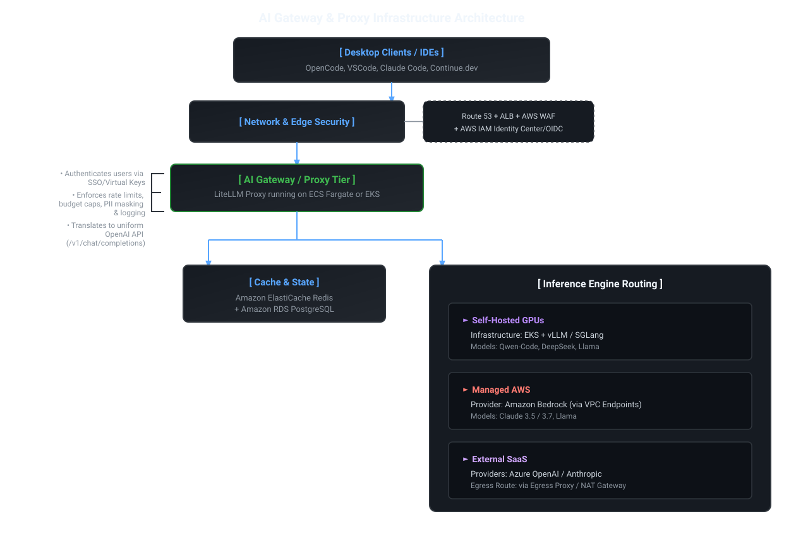
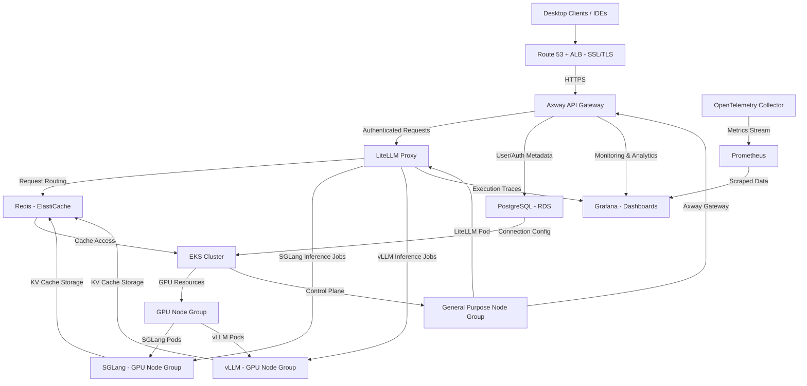

# AWS EKS Self-Hosted LLM Platform Deployment Guide

## Overview

This document provides a comprehensive deployment guide for implementing a self-hosted LLM platform on AWS EKS with multi-user access and model selection capabilities. The platform is designed to handle large KV caches for programming and legal document review workloads with large context windows.

## Infrastructure Architecture




### EKS Cluster Design

The EKS cluster is designed with two distinct node groups to optimize resource allocation:

1. **GPU Node Group**:

    - Purpose: Hosts AI workloads (vLLM inference containers or SGLang)
   - Instance Types: p4d.24xlarge, p5.48xlarge, g5.12xlarge (NVIDIA A100/H100/A10G)
   - Configuration: MIG-enabled for efficient resource sharing
   - Autoscaling: Karpenter for dynamic GPU scaling

2. **General Purpose Node Group**:

   - Purpose: Hosts management, monitoring, user console, API interface, and other control plane services
   - Instance Types: Intel or ARM-based instances (m5.large, c6i.large, etc.)
   - Configuration: Standard EC2 instances
   - Autoscaling: Standard EKS node scaling

This separation ensures optimal resource usage, security isolation, and cost efficiency between compute-intensive AI workloads and management/control services.

### API Gateway Integration

The platform integrates with **Axway API Gateway** for:
- API management and traffic control
- Security enforcement (authentication, authorization)
- Rate limiting and quota management
- Monitoring and analytics
- Policy enforcement for API access

## Phase 1: Infrastructure Setup (Week 1-2)

### 1.1 EKS Cluster Provisioning

- Create EKS cluster with proper VPC configuration
- Configure subnets for control plane and worker nodes
- Set up IAM roles and policies for EKS components
- Enable CloudWatch logging

### 1.2 Node Group Configuration

- **GPU Node Group**:
  - Use p4d.24xlarge/p5.48xlarge/g5.12xlarge instances
  - Enable Karpenter for autoscaling based on GPU demand
  - Configure MIG profiles for efficient resource sharing
  - Set up proper GPU driver management with NVIDIA GPU Operator

- **General Purpose Node Group**:

  - Use m5.large/c6i.large instances for management services
  - Configure standard EKS node scaling
  - Deploy monitoring and control plane components

### 1.3 Networking Implementation

- Deploy AWS Application Load Balancer (ALB) with SSL/TLS termination
- Configure AWS Route 53 and ACM for internal DNS and TLS certificates
- Set up WAF rules for security protection
- Configure VPC endpoints for secure AWS service access
- Implement proper security groups for isolation between node groups

## Phase 2: Core Platform Components (Week 2-3)

### 2.1 NVIDIA GPU Operator Deployment

- Install NVIDIA GPU Operator for driver management
- Configure MIG strategies for GPU partitioning:
  ```yaml
  apiVersion: v1
  kind: ConfigMap
  metadata:
    name: mig-strategy-config
    namespace: gpu-operator
  data:
    custom-mig-profile: |
      version: v1
      mig-configs:
        all-balanced:
          - device-filter: ["0x20b010de"]
            devices: [0]
            mig-enabled: true
            mig-devices:
              "3g.40gb": 1
              "2g.20gb": 2
  ```

### 2.2 KAI Scheduler Implementation

- Deploy KAI Scheduler using Helm:
  ```bash
  helm upgrade -i kai-scheduler oci://ghcr.io/nvidia/kai-scheduler/kai-scheduler \
    -n kai-scheduler --create-namespace \
    --set global.gpuSharing=true \
    --set binder.additionalArgs[0]=--cdi-enabled=true
  ```

### 2.3 Axway API Gateway Integration

- Deploy Axway API Gateway for:
  - API entry point and traffic management
  - Authentication and authorization via SSO
  - Rate limiting and quota enforcement
  - Security policy enforcement
- Configure API gateway to route requests to LiteLLM proxy

### 2.4 LiteLLM Gateway Setup

- Deploy LiteLLM proxy on EKS as stateless containers
- Configure model routing for different tiers:
  - Small Tier (Fast autocomplete)
  - Medium Tier (Balanced coding)
  - Large/Frontier Tier (Complex reasoning)
- Implement virtual key management system
- Set up fallback routing logic for high availability

## Phase 3: Data Stores and Security (Week 3)

### 3.1 Data Persistence Configuration

- Deploy Amazon ElastiCache for Redis:
  - Semantic caching of prompt-response pairs
  - Distributed lock and rate limiting
  - KV cache storage for large document processing
  - Support for large KV caches required for legal/document review

- Configure Amazon RDS (PostgreSQL):
  - Virtual key storage and management
  - User-team associations and access control
  - Usage/audit logs
  - Model routing policies
  - Document processing metadata storage

### 3.2 Security & Identity Integration

- Integrate with IAM Identity Center/Okta/Entra ID for SSO
- Implement OIDC/OAuth2 authentication
- Configure AWS Secrets Manager for API key management
- Set up proper RBAC policies for EKS resources
- Implement secure key rotation mechanisms

### 3.3 KV Cache Considerations

The platform is optimized to handle large KV caches required for:
- Programming context management (large codebases)
- Legal document review (extensive document processing)
- Long conversation history maintenance
- Code repository analysis

Storage configurations:
- Redis with appropriate memory allocation for large KV caches
- Optimization for memory-efficient storage of KV pairs
- Support for cache eviction policies when needed
- Consideration of Redis clustering for very large caches

## Phase 4: Model Infrastructure (Week 4)

### 4.1 vLLM or SGLang Deployment

- Deploy vLLM or SGLang containers targeting exact MIG device resources
- Configure pod specifications with proper resource limits
- Support for large context models and KV cache requirements
- Implementation of dynamic scaling based on workload demands

### 4.2 MIG Profile Management

- Configure different MIG profiles for various model requirements:
  - 1g.10gb for fast autocomplete models (limited KV cache)
  - 2g.20gb for agent loop models (medium KV cache)
  - 4g.40gb for chat/refactor models (large KV cache)
- Implement dynamic MIG configuration management for large document processing

### 4.3 Large Context Model Support

- Ensure vLLM or SGLang configurations support large context windows (16K+ tokens)
- Optimize KV cache memory allocation for document review tasks
- Configure memory-efficient attention mechanisms for large documents
- Implement proper memory management to handle large KV caches

## Phase 5: Multi-User Access & Model Selection (Week 5)

### 5.1 User Access Control Implementation

- Implement virtual key mapping to Active Directory teams/projects
- Create team/department based access controls
- Set up cost center tracking and budget limits
- Configure rate-limiting per team/individual developer
- Support for large context processing quotas (document review)

### 5.2 Model Tier Configuration

- Set up model aliases for seamless IDE integration
- Create model selection interface in the gateway
- Implement fallback logic for model availability
- Support for large document processing models
- Configure guardrails and PII masking for sensitive documents

### 5.3 Developer Experience

- Configure IDE extensions (VSCode, OpenCode, Continue.dev) with standard OpenAI settings
- Implement developer portal for key management and model selection
- Setup model selection dropdowns in IDE configurations
- Support for large context models in IDE integration
- Document review workflow optimization

## Phase 6: Observability & Monitoring (Week 6)

### 6.1 Telemetry Implementation

- Deploy OpenTelemetry with Langfuse/Arize Phoenix
- Configure full execution traces and prompt inputs tracking
- Set up token counting and latency breakdown monitoring
- Monitor KV cache usage for large document processing
- Implement dashboard for model performance and resource utilization

### 6.2 Cost Optimization for Large Workloads

- Configure AWS Cost Explorer for GPU usage tracking
- Implement token-level usage reporting by department
- Set up anomaly detection for cost optimization
- Monitor large KV cache storage usage
- Create monitoring for resource utilization efficiency for document processing tasks

### 6.3 KV Cache Management Monitoring

- Track cache hit ratios for large document processing
- Monitor cache size growth and memory usage
- Set up alerts for cache memory pressure
- Enable cache optimization recommendations

## Phase 7: Testing & Optimization (Week 7)

### 7.1 Performance Testing

- Load testing with multiple concurrent users
- Latency testing for different model tiers
- Resource utilization optimization for large KV caches
- Document review workload performance testing
- Fault tolerance testing for large context processing

### 7.2 Security Audit

- Access control validation
- Data governance compliance
- API security testing
- Key rotation implementation
- Large document processing security validation

## Key Implementation Considerations

1. **Large KV Cache Support**: The platform is specifically configured to handle large KV caches for programming and legal document review workloads through optimized Redis configurations and memory management.

2. **Axway API Gateway Integration**: Full integration with Axway for API management including authentication, rate limiting, and security enforcement.

3. **Resource Isolation**: Separate node groups ensure management services don't impact AI workload performance.

4. **Scalability for Large Workloads**: Designed to scale for document review tasks that require substantial KV cache storage.

## Required Resources

- 1 EKS cluster with dual node groups
- 2+ GPU instance types (p4d.24xlarge, p5.48xlarge, g5.12xlarge)
- AWS Application Load Balancer
- Amazon ElastiCache for Redis (with large memory configuration)
- Amazon RDS PostgreSQL instance
- AWS Secrets Manager
- VPC with appropriate subnets for EKS workers
- IAM Identity Provider integration (Okta/Entra ID/IAM Identity Center)
- Axway API Gateway deployment

This deployment guide ensures a robust, highly scalable, and secure self-hosted LLM platform optimized for handling large KV caches required for programming and legal document review workflows.

## Deployment Architecture (Mermaid Diagram)

