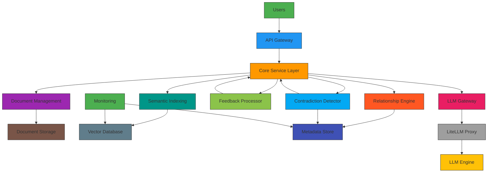

# Generic RAG/Feedback Loop System with Vector Store - Architecture

## Executive Summary

This document outlines the architecture for a generic RAG/feedback loop system that can be applied to various domains, with a primary focus on document management and relationship tracking. The system features a backing vector store for semantic similarity search and can be adapted for various use cases including legal documents, technical documentation, and knowledge management.

## System Overview

The system provides a flexible framework for building feedback/RAG loops with the following core capabilities:

1. **Document Management**: Ingest, store, and retrieve various types of documents
2. **Semantic Indexing**: Vector store for content similarity search
3. **Relationship Management**: Track connections between documents
4. **Feedback Integration**: Incorporate user feedback into processing
5. **Contradiction Detection**: Identify inconsistencies in related documents

## High-Level Architecture



## Core Components

### 1. Document Management Service

**Purpose**: Handle document ingestion, storage, and basic retrieval

**Key Features**:
- Multi-format document ingestion (PDF, DOCX, TXT, etc.)
- Content extraction and parsing
- Metadata extraction and tagging
- Document lifecycle management (create, update, delete)
- Version control system

**API Endpoints**:
```
POST /documents              # Upload new document
GET /documents/{id}          # Retrieve document details
PUT /documents/{id}          # Update document
DELETE /documents/{id}       # Delete document
GET /documents/search        # Search documents by content/metadata
```

### 2. Semantic Indexing System

**Purpose**: Store and retrieve documents using vector embeddings for semantic similarity

**Key Features**:
- Vector embedding generation for document content
- Efficient storage in vector database
- Semantic similarity search capabilities
- Vector-based document retrieval

**Storage Components**:
- **Vector Database**: Stores document embeddings for similarity search
- **Metadata Store**: Stores document metadata and relationships 
- **Document Storage**: Stores actual document content

### 3. Relationship Engine

**Purpose**: Track and manage relationships between documents

**Key Features**:
- Automatic relationship detection (explicit references, semantic connections)
- Manual relationship creation and management
- Relationship type classification (reference, related, conflicting)
- Relationship graph building and visualization

### 4. Feedback Processor

**Purpose**: Incorporate user feedback into document processing

**Key Features**:
- Feedback collection and processing
- Iterative document refinement
- Version control of feedback iterations
- Feedback integration with LLM processes

### 5. Contradiction Detection

**Purpose**: Identify inconsistencies and contradictions in related documents

**Key Features**:
- Explicit contradiction detection (clear conflicting statements)
- Semantic inconsistency analysis (similar content that may conflict)
- Confidence scoring for detected issues
- Reporting and highlighting capabilities

### 6. LLM Integration Layer

**Purpose**: Connect with language models for complex processing tasks

**Key Features**:
- Context-aware document retrieval for LLM processing
- Feedback incorporation into LLM prompts
- Content generation with cross-reference awareness
- Iterative refinement based on feedback

## Data Flow Architecture

### Document Ingestion Process
1. User uploads document via API
2. Document content is parsed and metadata extracted
3. Semantic embeddings are generated and stored in vector database
4. Document content is stored in document storage
5. Metadata is stored in metadata store
6. Initial relationship analysis is performed
7. Document is marked as ready for processing

### RAG Loop Process
1. User requests document analysis or generation
2. Context is determined (user query, related documents, etc.)
3. Relevant documents are retrieved from vector database using semantic search
4. Relationships between documents are analyzed
5. Contradictions are detected in related documents
6. LLM is called with context-aware prompt including:
   - Document content
   - Cross-references
   - Contradiction information
7. Generated content is returned with references and warnings
8. Feedback is processed to refine future iterations

## Integration with Existing Infrastructure

### EKS Integration
- Deployment of all microservices as Kubernetes pods
- Service discovery and load balancing via Kubernetes
- Horizontal pod autoscaling based on workload
- Resource management for GPU-accelerated NLP tasks (if needed)

### LiteLLM Integration
- Direct integration with existing LiteLLM proxy
- Standard OpenAI API compatibility for LLM interactions
- Model routing based on document complexity and requirements

### Storage Integration
- **Redis**: Caching of frequently accessed documents and metadata
- **PostgreSQL**: Structured metadata storage
- **S3/Storage**: Document content storage
- **Vector Database**: Semantic similarity storage

## Technology Stack

### Backend Services
- **Language**: Python 3.9+
- **Framework**: FastAPI (for REST APIs)
- **Database**: PostgreSQL 13+ (metadata)
- **Cache**: Redis 6.x
- **Vector Database**: Chroma, Weaviate, or Pinecone
- **Containerization**: Docker
- **Orchestration**: Kubernetes (EKS)

### NLP & AI Components
- **NLP Libraries**: spaCy, transformers (Hugging Face)
- **Embedding Models**: Sentence Transformers, BERT-based models
- **LLM Integration**: LiteLLM proxy integration

### Infrastructure
- **Cloud Platform**: AWS (EKS, S3, RDS)
- **Monitoring**: Prometheus + Grafana
- **Logging**: ELK Stack or AWS CloudWatch
- **Security**: AWS IAM, TLS encryption

## Security Considerations

### Access Control
1. **Role-Based Access Control (RBAC)**
   - User roles (Viewer, Editor, Administrator)
   - Document-level permissions
   - Audit logging for all access and modifications

2. **Data Protection**
   - Encrypted storage for sensitive documents
   - Secure transmission using TLS
   - Role-based access to advanced features

### Compliance
1. **Audit Trail**
   - Complete log of all document interactions
   - Timestamped changes with user identification
   - Version control and rollback capabilities

2. **Data Governance**
   - Retention policies based on document classification
   - Access control based on document sensitivity
   - Data export capabilities for compliance

## Implementation Roadmap

### Phase 1: Core Infrastructure (Weeks 1-4)
1. Environment setup with Kubernetes
2. Document management service implementation
3. Database schema creation (PostgreSQL, Redis)
4. Vector database integration setup

### Phase 2: Core Processing (Weeks 5-8)
1. Semantic indexing system implementation
2. Relationship engine development
3. Contradiction detection system
4. API development and testing

### Phase 3: LLM Integration (Weeks 9-12)
1. RAG loop integration with LLM
2. Feedback processing engine
3. Context-aware document retrieval
4. Performance optimization

### Phase 4: Testing & Deployment (Weeks 13-16)
1. Comprehensive testing
2. Performance optimization
3. Security hardening
4. Production deployment setup

## Monitoring and Observability

### Metrics Collection
1. **System Performance**:
   - Document processing time
   - API response times
   - Database query performance
   - LLM call latency

2. **User Activity**:
   - Document access patterns
   - Feature usage statistics
   - User engagement metrics

### Alerting and Notifications
1. **Critical Issues**:
   - Database connectivity problems
   - Performance degradation thresholds
   - System resource exhaustion

2. **Business Events**:
   - High-impact contradiction detection
   - System performance anomalies
   - Security and access violations

## Future Extensibility

1. **Domain-Specific Enhancements**:
   - Legal document specific rules and patterns
   - Technical documentation classifiers
   - Academic research document analysis

2. **Advanced AI Integration**:
   - Enhanced contradiction detection using ML models
   - Advanced semantic understanding
   - Predictive relationship identification

3. **User Experience Improvements**:
   - Interactive relationship visualization
   - Automated contradiction resolution suggestions
   - Collaborative document editing features

## Conclusion

This architecture provides a robust foundation for a generic RAG/feedback loop system that can be adapted to various domains while maintaining core capabilities for document management, semantic search, relationship tracking, and contradiction detection. The system is designed to integrate seamlessly with existing AWS infrastructure and can be scaled to handle diverse document management requirements.