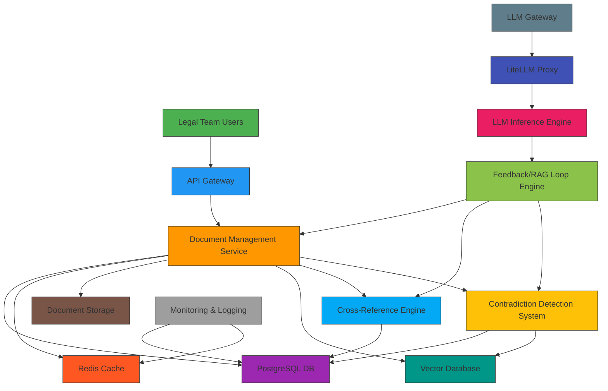

# Legal Document Feedback/RAG Loop System - Detailed Architecture

## System Overview

This document provides a detailed architectural design for a feedback/RAG loop system tailored for Legal team document management. The system ensures document consistency, maintains cross-references, and detects contradictions while integrating with the existing AWS infrastructure.

## High-Level Architecture Diagram



## Detailed Component Design

### 1. Document Management Service

**Purpose**: Core service for handling document operations and metadata management.

**Key Features**:
- Document ingestion (upload, parsing, storage)
- Metadata extraction and tagging
- Version control system
- Document lifecycle management
- Relationship management API

**API Endpoints**:
```
POST /documents                     # Upload new document
GET /documents/{id}                 # Retrieve document details  
PUT /documents/{id}                 # Update document
DELETE /documents/{id}              # Delete document
GET /documents/search               # Search documents
GET /documents/{id}/metadata        # Get document metadata
PUT /documents/{id}/metadata        # Update document metadata
```

### 2. Metadata Tracking System

**Purpose**: Structured storage and management of document metadata.

**Data Model**:
```sql
-- Documents table
CREATE TABLE documents (
    id UUID PRIMARY KEY,
    title VARCHAR(255),
    document_type VARCHAR(100), -- contract, MSA, SLA, etc.
    version VARCHAR(50),
    author VARCHAR(255),
    created_at TIMESTAMP,
    updated_at TIMESTAMP,
    content TEXT,
    storage_path VARCHAR(500),
    metadata JSONB -- structured metadata
);

-- Document metadata table
CREATE TABLE document_metadata (
    id UUID PRIMARY KEY,
    document_id UUID REFERENCES documents(id),
    key VARCHAR(255),
    value TEXT,
    type VARCHAR(50) -- string, integer, date, etc.
);

-- Document relationships table  
CREATE TABLE document_relationships (
    id UUID PRIMARY KEY,
    source_document_id UUID REFERENCES documents(id),
    target_document_id UUID REFERENCES documents(id),
    relationship_type VARCHAR(100), -- reference, related, conflicting
    description TEXT,
    created_at TIMESTAMP
);
```

### 3. Cross-Reference Engine

**Purpose**: Detect and maintain both explicit and semantic relationships between documents.

**Key Features**:
- Explicit reference detection (document numbers, section references)
- Semantic relationship analysis using NLP
- Relationship graph building and maintenance
- Cross-reference validation

**Technology Stack**:
- NLP libraries (spaCy, transformers) for semantic analysis
- Graph database for relationship management
- Regular expression and pattern matching for explicit references

### 4. Contradiction Detection System

**Purpose**: Identify potential contradictions between documents.

**Approach**:
1. **Explicit Contradiction Detection**:
   - Pattern matching for clearly conflicting clauses
   - Rule-based system for common contradiction patterns
   
2. **Semantic Inconsistency Analysis**:
   - Similarity analysis using embeddings
   - Contextual comparison of related documents
   - Confidence scoring for detected issues

**API Endpoints**:
```
POST /documents/{id}/analyze        # Analyze document for contradictions
POST /documents/{id}/find-conflicts # Find conflicting documents
GET /documents/{id}/contradictions  # Get contradiction report
```

### 5. RAG Loop Integration Layer

**Purpose**: Connect document processing with LLM capabilities for iterative refinement.

**Components**:
- Context manager for relevant documents
- Feedback incorporation system
- Content generation with reference awareness
- Iterative processing loop

**Key Processes**:
1. **Document Retrieval**: Fetch relevant documents based on context
2. **Relationship Analysis**: Analyze cross-references and relationships  
3. **Contradiction Detection**: Identify inconsistencies
4. **LLM Processing**: Generate or modify content using LLM
5. **Feedback Loop**: Incorporate results back into system

### 6. Storage & Indexing Layer

**Components**:
1. **PostgreSQL Database**:
   - Primary storage for structured metadata
   - Document relationship storage
   - User and access control data

2. **Redis Cache**:
   - Frequently accessed document metadata
   - Temporary processing state
   - Session management

3. **Document Storage**:
   - S3 or local filesystem for document content
   - Version control for document storage

4. **Vector Database**:
   - Semantic embeddings for similarity search
   - Efficient document matching by content
   - Support for vector-based retrieval

## Data Flow Process

### Document Ingestion Process
1. User uploads document via API
2. Document is stored in storage backend
3. Metadata is extracted and stored in PostgreSQL
4. Content is parsed for references and key clauses
5. Semantic embedding is generated and stored in vector database
6. Initial relationship analysis is performed
7. Document is marked as "processed" and available for use

### RAG Loop Process
1. User requests document analysis or generation
2. Context is determined (document type, related documents, etc.)
3. Relevant documents are retrieved from storage
4. Cross-references are identified and validated
5. Contradiction detection runs on related documents
6. LLM is called with context-aware prompt including:
   - Document content
   - Cross-references 
   - Contradiction information
7. Generated content is returned with references and warnings
8. Feedback is processed to refine future iterations

## Security and Access Control

### Access Control Model
1. **Document-Level Access**:
   - Role-based permissions (Legal Team Member, Legal Manager)
   - Document ownership and sharing rules
   - Audit logging for all access and modifications

2. **Data Protection**:
   - Encrypted storage for sensitive documents
   - Secure transmission using TLS
   - Role-based access to contradiction analysis

### Compliance Considerations
1. **Audit Trail**:
   - Complete log of all document interactions
   - Timestamped changes with user identification
   - Version control and rollback capabilities

2. **Data Governance**:
   - Retention policies based on document type
   - Access control based on document classification
   - Data export capabilities for compliance

## Integration with Existing AWS Infrastructure

### EKS Cluster Integration
1. **Deployment**:
   - Document management service deployed as Kubernetes pods
   - Scalable architecture using Kubernetes deployments
   - Resource requests and limits for GPU acceleration (if needed)

2. **Networking**:
   - Service discovery via Kubernetes DNS
   - Load balancing for high availability
   - Security groups for pod-to-pod communication

### LiteLLM Integration
1. **LLM Gateway**:
   - Connect to existing LiteLLM proxy for LLM interactions
   - Standard OpenAI API compatibility for easy integration
   - Model routing based on document type and complexity

2. **Authentication**:
   - Use existing virtual key system for access control
   - Secure API key handling and rotation

### Redis Integration
1. **Caching Layer**:
   - Cache frequently accessed document metadata
   - Session management for user interactions
   - Temporary state during processing

2. **Performance Optimization**:
   - Redis cluster for high availability
   - Memory optimization for cache management

### PostgreSQL Integration
1. **Structured Data Storage**:
   - Primary storage for metadata and document relationships
   - Query optimization for relationship and contradiction analysis
   - Backup and recovery strategies

2. **Scalability**:
   - Connection pooling for efficient database access
   - Indexing strategies for performance

## Monitoring and Observability

### Metrics Collection
1. **System Performance**:
   - Document processing time
   - API response times
   - Database query performance

2. **User Activity**:
   - Document access patterns
   - Analysis request frequency
   - User engagement with contradiction warnings

### Alerting and Notifications
1. **Critical Issues**:
   - Database connectivity problems
   - Storage capacity warnings
   - LLM access failures

2. **Business Events**:
   - High-impact contradiction detection
   - Document access anomalies
   - System performance degradation alerts

## Implementation Roadmap

### Phase 1: Core Infrastructure (Weeks 1-2)
- Document Management Service implementation
- Metadata tracking system
- Basic PostgreSQL database schema
- Core API endpoints

### Phase 2: Reference Management (Weeks 3-4)
- Cross-reference engine development
- Explicit reference detection
- Semantic relationship analysis
- Relationship graph building

### Phase 3: Contradiction Detection (Weeks 5-6)
- Contradiction detection system
- Rule-based contradiction identification
- Semantic inconsistency analysis
- Integration with LLM workflows

### Phase 4: RAG Loop Integration (Weeks 7-8)
- Feedback/RAG loop implementation
- Context-aware document retrieval
- LLM integration for content generation
- Iterative processing capabilities

### Phase 5: Enhancement & Optimization (Weeks 9-10)
- Performance optimization
- User interface development
- Advanced querying capabilities
- Automated alerting system

## Technology Stack

### Backend Services
- **Language**: Python 3.9+
- **Framework**: FastAPI (for REST APIs)
- **Database**: PostgreSQL 13+
- **Cache**: Redis 6.x
- **Vector Database**: Chroma, Weaviate, or Pinecone
- **Containerization**: Docker
- **Orchestration**: Kubernetes (EKS)

### NLP & AI Components
- **NLP Libraries**: spaCy, Transformers (Hugging Face)
- **Embedding Models**: Sentence Transformers, BERT-based models
- **LLM Integration**: LiteLLM proxy integration

### Infrastructure
- **Cloud Platform**: AWS (EKS, S3, RDS)
- **Monitoring**: Prometheus + Grafana
- **Logging**: ELK Stack or AWS CloudWatch
- **Security**: AWS IAM, TLS encryption

## Scalability Considerations

### Horizontal Scaling
1. **Microservices Architecture**:
   - Independent scaling of document management
   - Dedicated services for analysis and retrieval

2. **Database Scaling**:
   - PostgreSQL read replicas for high query volume
   - Vector database clustering for similarity search

### Performance Optimization
1. **Caching Strategy**:
   - Redis for frequently accessed metadata
   - CDN for document assets where applicable

2. **Batch Processing**:
   - Asynchronous processing for heavy analysis tasks
   - Queue-based processing for document ingestion

## Future Enhancements

1. **Machine Learning Improvements**:
   - Enhanced contradiction detection using ML models
   - Auto-suggestion for document alignment

2. **Advanced User Interface**:
   - Visual relationship mapping
   - Interactive contradiction explorer

3. **Integration Capabilities**:
   - Microsoft Office integration
   - Collaboration features for legal teams
   - Document template management

## Conclusion

This architecture provides a robust foundation for a Legal team feedback/RAG loop system that maintains document consistency, tracks cross-references, and detects contradictions. The modular design allows for gradual implementation while ensuring integration with the existing AWS infrastructure.