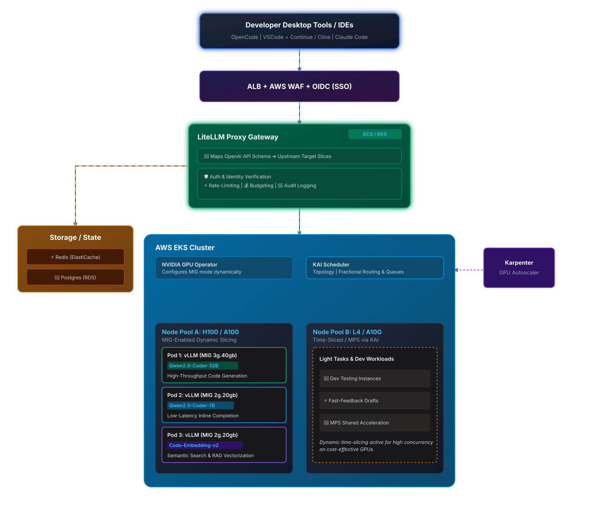
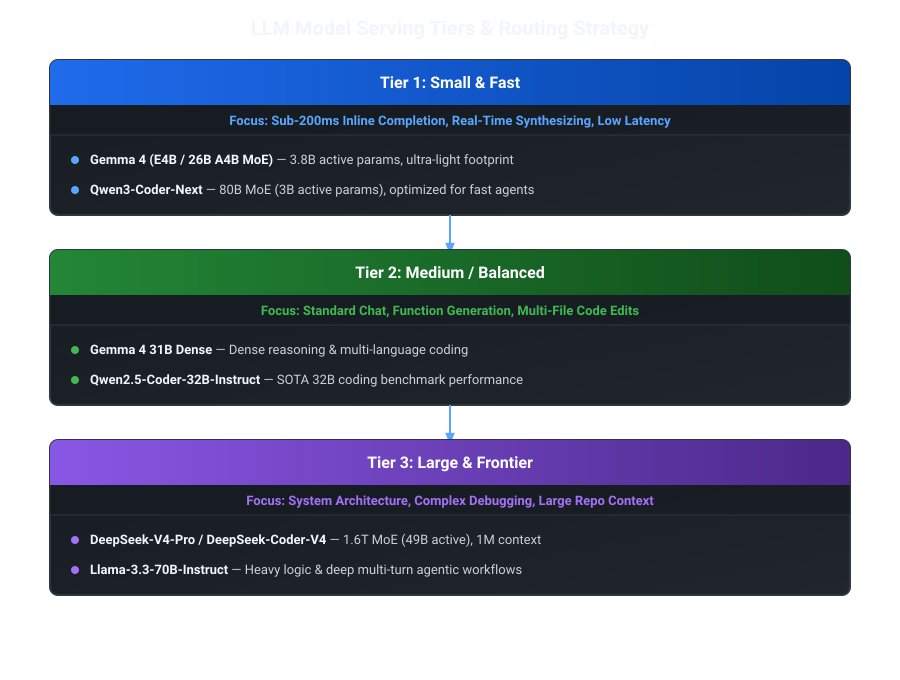

# Self Hosted GPU Stack on AWS


Building a self-hosted| multi-model AI platform in an AWS corporate account—standardized on the OpenAI API format—requires a modular| enterprise-grade architecture. This architecture handles everything from local developer tools (OpenCode| Claude Code| VSCode extensions) to backend model inference engines running on private GPUs or managed services.

### High-Level Architecture Overview


---

## Detailed Architectural Stack Layer-by-Layer

### 1. Client & IDE Integration Layer

Developer desktop tools interact exclusively with the platform through a single API base URL ([https://ai-gateway.corp.domain.com/v1](https://ai-gateway.corp.domain.com/v1)) using standard OpenAI API specification headers.

- Supported Tools:
    - VS Code Extensions: Continue.dev| Cline / Roo Code| GitHub Copilot (custom endpoint configuration)| or Codeium.
    - CLI / AI Tools: OpenCode| Claude Code| Qwen Code CLI| Aider.
- Authentication & Access: Developers generate a Virtual API Key from a self-service internal portal or use SSO tokens (OIDC/SAML) tied to their corporate identity.

### 2. Networking| Ingress & Identity Layer

Controls incoming enterprise traffic and enforces zero-trust boundary rules.

- AWS Route 53 + AWS Certificate Manager (ACM): Handles internal DNS and TLS termination for custom enterprise domain endpoints.
- AWS Application Load Balancer (ALB): Public or internal-facing load balancer with SSL/TLS termination| integrated with AWS WAF to block SQLi| XSS| and rate-abuse spikes.
- Identity Provider Integration (IAM Identity Center / Okta / Entra ID): Authenticates developer requests via OIDC/OAuth2 before key issuance.

### 3. AI Gateway & Proxy Tier (The Standardizer)

The critical core of the platform that standardizes heterogeneous upstream models into a unified OpenAI REST API schema.

- Core Technology: LiteLLM Proxy (deployed as stateless containers on Amazon ECS Fargate or Amazon EKS).
- Key Responsibilities:
    - Interface Standardization: Maps requests sent to /v1/chat/completions| /v1/models| or /v1/embeddings into native formats for underlying targets (vLLM| SGLang| Bedrock| Anthropic| Ollama| etc.).
    - Virtual Key Management: Issues virtual keys mapped to specific Active Directory teams| projects| or cost centers.
    - Guardrails & PII Masking: Integrates with tools like Presidio or LLM Guard for real-time redaction of sensitive source code| AWS credentials| and PII before sending to external endpoints.
    - Rate-Limiting & Budget Control: Enforces strict TPM (Tokens Per Minute)| RPM (Requests Per Minute)| and monthly hard/soft budget limits per team or individual developer.
    - Model Alias Fallbacks: If a primary model fails or throttles| the gateway automatically falls back to an equivalent model (e.g.| qwen-2.5-coder-32b \rightarrow claude-3-5-sonnet) seamlessly.

### 4. Storage| Cache & State Layer

Maintains gateway state| request caching| metrics| and secret keys.

- Amazon ElastiCache for Redis:
    - Semantic Caching: Stores prompt-response pairs to prevent re-computing duplicate completions across developers.
    - Distributed Lock & Rate Limiting: Enforces instant sliding-window token limits across multi-region gateway instances.
- Amazon RDS (PostgreSQL):
    - Stores LiteLLM virtual keys| user-team associations| usage/audit logs| model routing policies| and historical token usage statistics.
- AWS Secrets Manager:
    - Stores upstream provider master API keys (e.g.| Anthropic keys| OpenAI keys| internal service tokens). LiteLLM dynamically resolves secrets via AWS IAM roles without hardcoding credentials.

### 5. Model Inference Engine Tier (Backend Compute)

This tier hosts self-hosted open-weights coding models alongside managed enterprise services.

#### A. Self-Hosted Open-Weights Compute (On-AWS GPUs)

- Orchestrator: Amazon EKS (Elastic Kubernetes Service) with Karpenter for rapid autoscaling of GPU node pools.
- Inference Server: vLLM or SGLang containers.
    - Why vLLM? Offers native OpenAI-compatible REST endpoints (/v1)| high throughput with PagedAttention| continuous batching| and chunked prefill.
    - Why SGLang? Offers native OpenAI-compatible REST endpoints (/v1)| high throughput with RadixAttention| continuous batching| and chunked prefill.
- Hardware Instances:
    - g5.2xlarge / g5.12xlarge (NVIDIA A10G) for models up to 14B–32B parameters.
    - p4d.24xlarge / p5.48xlarge (NVIDIA A100 / H100) or inf2 (AWS Inferentia2) for deep reasoning models (70B+ parameters).
- Primary Open Coding Models Served:
    - Qwen2.5-Coder-32B-Instruct (SOTA open coding performance).
    - DeepSeek-Coder-V2-Lite-Instruct.
    - Llama-3.3-70B-Instruct.

#### B. Managed Cloud Backends (Hybrid/SaaS)

- Amazon Bedrock: Access Claude 3.5 Sonnet| Claude 3.7 Sonnet| or Llama 3 via AWS PrivateLink / VPC Endpoints without traffic traversing the public internet.
- AWS SageMaker Endpoints: For specialized custom fine-tuned code completion models hosted inside private VPC subnets.

### 6. Observability| Telemetry & Audit Layer

Monitors model latency| token costs| security violations| and system reliability.

- OpenTelemetry & Langfuse / Arize Phoenix: Captures full execution traces| prompt inputs| code context completions| token counts| and step-by-step latency breakdown.
- Amazon CloudWatch Logs & Metrics: Centralizes infrastructure logs from EKS| ECS| and ALB.
- AWS Cost Explorer & Anomaly Detection: Tracks GPU usage spend alongside token-level usage broken down by corporate department tags.

Example Configuration & Integration Flow

Gateway Routing Table (config.yaml on LiteLLM)

```yaml
model_list:
  # Self-Hosted vLLM on EKS
  - model_name: qwen-coder
    litellm_params:
      model: openai/qwen2.5-coder-32b
      api_base: http://vllm-qwen.internal.eks.local:8000/v1
      api_key: "vllm-internal-key"

  # Managed Amazon Bedrock Target
  - model_name: claude-sonnet
    litellm_params:
      model: bedrock/anthropic.claude-3-5-sonnet-20241022-v2:0
      aws_region_name: us-east-1

  # Alias mapping to standard OpenAI naming for seamless IDE support
  - model_name: gpt-4o
    litellm_params:
      model: bedrock/anthropic.claude-3-5-sonnet-20241022-v2:0

router_settings:
  routing_strategy: usage-based-routing-v2
  fallbacks: [{"qwen-coder": ["claude-sonnet"]}]
```

Local Developer IDE Setup Example (e.g.| VSCode / OpenCode / Continue.dev)

Developers configure their local tools to target the internal corporate gateway using standard OpenAI settings:

```yaml
{
  "models": [
    {
      "title": "Corporate Qwen Coder (Self-Hosted)"|
      "provider": "openai"|
      "model": "qwen-coder"|
      "apiBase": "https://ai-gateway.corp.domain.com/v1"|
      "apiKey": "sk-corp-virt-key-839210"
    }|
    {
      "title": "Corporate Claude 3.5 Sonnet"|
      "provider": "openai"|
      "model": "claude-sonnet"|
      "apiBase": "https://ai-gateway.corp.domain.com/v1"|
      "apiKey": "sk-corp-virt-key-839210"
    }
  ]
}
```

---

## Summary of Enterprise Benefits

1. Zero Client Refactoring: Developers use standard open-source IDE extensions without custom plugins—the LiteLLM gateway maps all requests to the OpenAI format.  

2. Data Governance & Sovereignty: Code stays within the corporate AWS VPC when querying self-hosted vLLM models or AWS Bedrock via PrivateLink.

3. Cost Optimization: Auto-scales GPU instances via EKS/Karpenter and enforces real-time budget limits and semantic caching to prevent redundant LLM invocations.

---

## KAI Scheduler

Adding KAI Scheduler and hardware-level NVIDIA MIG (Multi-Instance GPU) slicing changes the backend efficiency of the architecture. Instead of assigning an entire $10|000+ GPU to a light coding model or single developer| you can slice GPUs safely in silicon and dynamically schedule micro-workloads across your cluster.

---

## Technical Feasibility & Confirmation: NVIDIA MIG Slicing

MIG is fully supported| battle-tested| and functional on modern enterprise NVIDIA cards. It allows you to partition a physical GPU into up to 7 isolated GPU instances.

### 1. Hardware Compatibility

- Supported AWS GPU Instances:
    - p4d.24xlarge / p4de.24xlarge (NVIDIA A100 40GB/80GB)
    - p5.48xlarge (NVIDIA H100 80GB)  

- Non-MIG Cards (Alternative: MPS or Time-Slicing):
    - g5 instances (NVIDIA A10G) and g6 instances (NVIDIA L4) do not support hardware MIG. For these cards| software-based CUDA Multi-Process Service (MPS) or Time-Slicing is used via the NVIDIA GPU Operator.

### 2. Why MIG for IDE Code Completion Models?

Unlike software time-slicing| MIG isolates hardware at the silicon level (dedicated Streaming Multiprocessors| memory controllers| and L2 cache):  


- No Out-Of-Memory (OOM) Cascades: If a developer triggers an huge context completion on one model| it cannot crash adjacent models on the same card.
- Deterministic Latency (Guaranteed QoS): Essential for IDE inline autocomplete (Tab completion)| where responses must return in under 200 milliseconds without jitter.

Adding KAI Scheduler and hardware-level NVIDIA MIG (Multi-Instance GPU) slicing changes the backend efficiency of the architecture. Instead of assigning an entire $10|000+ GPU to a light coding model or single developer| you can slice GPUs safely in silicon and dynamically schedule micro-workloads across your cluster.

Technical Feasibility & Confirmation: NVIDIA MIG Slicing
MIG is fully supported| battle-tested| and functional on modern enterprise NVIDIA cards. It allows you to partition a physical GPU into up to 7 isolated GPU instances.  


#### 1. Hardware Compatibility

Supported AWS GPU Instances:
p4d.24xlarge / p4de.24xlarge (NVIDIA A100 40GB/80GB)
p5.48xlarge (NVIDIA H100 80GB)  

Non-MIG Cards (Alternative: MPS or Time-Slicing):
g5 instances (NVIDIA A10G) and g6 instances (NVIDIA L4) do not support hardware MIG. For these cards| software-based CUDA Multi-Process Service (MPS) or Time-Slicing is used via the NVIDIA GPU Operator.  


#### 2. Why MIG for IDE Code Completion Models?

Unlike software time-slicing| MIG isolates hardware at the silicon level (dedicated Streaming Multiprocessors| memory controllers| and L2 cache):  

No Out-Of-Memory (OOM) Cascades: If a developer triggers an huge context completion on one model| it cannot crash adjacent models on the same card.
Deterministic Latency (Guaranteed QoS): Essential for IDE inline autocomplete (Tab completion)| where responses must return in under 200 milliseconds without jitter.

#### 3. Slicing SOTA Coding Models on an A100 / H100 (80GB)

On an A100-80GB| you can configure MIG profiles such as:

```
Physical GPU: 80GB VRAM
├── MIG Slice 1: 3g.40gb (40GB VRAM) ──► vLLM: Qwen2.5-Coder-32B-Instruct (FP8 / AWQ)
├── MIG Slice 2: 2g.20gb (20GB VRAM) ──► vLLM: Qwen2.5-Coder-7B-Instruct (FP16)
└── MIG Slice 3: 2g.20gb (20GB VRAM) ──► vLLM: DeepSeek-Coder-V2-Lite / Embeddings
```

---

## Introducing the KAI Scheduler into the Stack

KAI Scheduler (originally open-sourced from Run:ai under Apache 2.0) is a Kubernetes-native scheduler built specifically for complex AI/ML workloads.  
kai-scheduler.dev

In a default EKS cluster| the standard kube-scheduler treats GPUs as binary units (assigns 1 whole GPU per container or relies on simple static device plugins). KAI Scheduler sits alongside EKS to manage multi-tenant queueing| topology awareness| and dynamic slicing.

### Key Benefits of KAI Scheduler for Enterprise IDE Workloads

1. Dynamic MIG & Fractional Resource Scheduling: KAI natively understands MIG profiles ([nvidia.com/mig-2g.20gb](https://nvidia.com/mig-2g.20gb))| software time-slicing| and fractional GPU requests.
2. Hierarchical Queues & Quotas: Create multi-level queue trees (e.g.| Engineering -> Backend Team -> Developer A) with guaranteed GPU VRAM quotas and over-quota borrowing.
3. Bin-Packing & Consolidation: Packs smaller coding model instances tightly into shared GPU nodes| drastically cutting AWS EC2 compute spend.
4. Gang Scheduling & Priority Preemption: Ensures batch training/fine-tuning tasks pause automatically when interactive developer autocomplete jobs require capacity.

**Expanded Architecture Stack Layout**





---

## Kubernetes & Deployment Implementation Details

To realize this stack| the EKS cluster uses three primary components:

### 1. NVIDIA GPU Operator (Configuring MIG Mode on EKS)

Apply a ConfigMap to the gpu-operator to define MIG profile strategies automatically across node pools:

```yaml
apiVersion: v1
kind: ConfigMap
metadata:
  name: mig-strategy-config
  namespace: gpu-operator
data:
  # Instructs GPU operator to slice 80GB GPUs into mixed profiles
  custom-mig-profile: |
    version: v1
    mig-configs:
      all-balanced:
        - device-filter: ["0x20b010de"] # A100 80GB PCI ID
          devices: [0]
          mig-enabled: true
          mig-devices:
            "3g.40gb": 1
            "2g.20gb": 2
```

### 2. KAI Scheduler Deployment & Queue Configuration

Deploy KAI via Helm alongside standard EKS:

```bash
helm upgrade -i kai-scheduler oci://ghcr.io/nvidia/kai-scheduler/kai-scheduler \
  -n kai-scheduler --create-namespace \
  --set global.gpuSharing=true \
  --set binder.additionalArgs[0]=--cdi-enabled=true
```

Define team queues in KAI so developer teams share GPU slices dynamically:

```yaml
apiVersion: scheduling.kai.org/v1alpha1
kind: Queue
metadata:
  name: dev-team-code-completion
spec:
  parent: engineering-org
  resources:
    guaranteed:
      nvidia.com/mig-2g.20gb: "4" # Guaranteed 4 slices for code context
    deserved:
      nvidia.com/mig-2g.20gb: "8" # Can burst up to 8 when cluster is idle
```

### 3. vLLM or SGLang Pod Specification Targetting MIG via KAI

Deploy vLLM or SGLang containers targeting exact MIG device resources| managed by KAI:

```yaml
apiVersion: apps/v1
kind: Deployment
metadata:
  name: vllm-qwen-coder-7b
spec:
  replicas: 2
  template:
    metadata:
      labels:
        app: vllm-qwen-coder-7b
    spec:
      schedulerName: kai-scheduler # Routes pod via KAI Scheduler
      containers:
      - name: vllm-container
        image: vllm/vllm-openai:latest
        args:
          - "--model=Qwen/Qwen2.5-Coder-7B-Instruct"
          - "--gpu-memory-utilization=0.90"
          - "--max-model-len=16384"
        resources:
          limits:
            nvidia.com/mig-2g.20gb: "1" # Demands exactly 1x 20GB hardware MIG slice
          requests:
            nvidia.com/mig-2g.20gb: "1"
```

---

## Architectural Verdict & Summary

By integrating KAI Scheduler and NVIDIA MIG Slicing into the AWS stack:

1. Capacity Multiplication: A single p4de.24xlarge instance (8x A100 80GB) can run up to 56 distinct vLLM model slices| isolating small autocomplete models from heavy chat models.
2. Guaranteed SLA for IDEs: MIG hardware isolation guarantees that context-heavy developer prompts won't degrade the sub-second latency required for IDE auto-fill.
3. Fair Multi-Tenancy: KAI Scheduler prevents one developer team or IDE client from starving others through priority queuing| fractional allocations| and automated preemption.

---

## AWS GPU Instances

Amazon Web Services (AWS) categorizes its GPU-powered EC2 instances under the "Accelerated Computing" category| primarily split into the entry-to-mid-tier G family and the ultra-high-performance P family.


### Quick Selection Matrix 

|Family / Instance Type|Core GPU Used|VRAM per GPU|Best Use Case|
|:--- |:--- |:--- |:--- |
|G4dn| NVIDIA T4          |16 GB                 |Affordable ML inference| small model training|
|G4ad| AMD Radeon Pro V520|8 GB                  |Graphics rendering| cloud gaming workstations|
|G5  | NVIDIA A10G        |24 GB                 |High-fidelity graphics| mid-tier LLM training/inference|
|P4  | NVIDIA A100        |40 GB / 80 GB         |Large-scale AI training| deep learning clusters|
|P5  | NVIDIA H100        |80 GB                 |Generative AI training| massive Large Language Models|
|P6e | NVIDIA GB200       |Up to 13.4 TB (System)|Next-gen massive distributed AI workloads|

---

## Open-Weights Models

To accommodate a multi-tiered model selection strategy—ranging from ultra-fast| small models for instant inline autocompletion (Tab completions) to massive frontier reasoning models for complex refactoring—here is the updated open-weights model lineup and infrastructure layout.

### 1. Updated Open-Weights Model Spectrum

Organized across Small| Medium| and Large / Frontier tiers| developers select models directly from standard IDE dropdowns (VSCode| OpenCode| Claude Code) based on latency and task complexity.




|Tier|Model|Architecture|Primary IDE Use Case|Recommended Hardware/Slice|
:--- |:--- |:--- |:--- |:--- |
|Small|Gemma 4 (26B A4B)|MoE (3.8B active)|"Inline Tab completion| rapid linting"|mig-1g.10gb or g5.xlarge|
|Small|Qwen3-Coder-Next|MoE (3B active)|"Fast agentic loops| terminal commands"|mig-2g.20gb or g5.2xlarge|
|Medium|Gemma 4 (31B Dense)|Dense (30.7B)|"Unit test generation| script writing"|mig-3g.40gb or p4d.24xlarge|
|Medium|Qwen2.5-Coder-32B|Dense (32.5B)|"Full function implementation| code refactoring"|mig-3g.40gb or g5.12xlarge|
|Large|Llama-3.3-70B-Instruct|Dense (70B)|"Architectural design| security code reviews"|2x A100-80GB / mig-7g.79gb|
|Frontier|DeepSeek-V4-Pro / Coder|MoE (49B active / 1.6T total)|"Repo-wide reasoning| 1M context debugging"|Dedicated p4d / p5 GPU cluster|


### 2. Updated NVIDIA MIG & KAI Scheduling Layout

To run this mixed-tier ecosystem cost-effectively on AWS, NVIDIA MIG slices physical GPUs to handle small and medium models side-by-side, while dedicated GPU pools handle the heavy frontier MoE models.

A100 (80GB) Slicing Layout (Interactive Slices)
A single NVIDIA A100-80GB card hosted on a p4d.24xlarge instance is sliced into three distinct profiles:

```
Physical A100-80GB GPU
├── MIG 1g.10gb (10GB VRAM) ──► Pod: vLLM (Gemma 4 26B A4B MoE - FP8) [Tab Autocomplete]
├── MIG 2g.20gb (20GB VRAM) ──► Pod: vLLM (Qwen3-Coder-Next - 3B Active) [Agent Loops]
└── MIG 4g.40gb (40GB VRAM) ──► Pod: vLLM (Qwen2.5-Coder-32B or Gemma 4 31B) [Chat/Refactor]
```

3. ### Dynamic KAI Queue Routing

KAI Scheduler assigns incoming pod deployment requests into prioritized queues to ensure small models get instant execution slots:

- high-priority-autocomplete Queue: Bound to mig-1g.10gb / mig-2g.20gb slices. Zero preemption allowed, ensuring developer keystrokes never wait on queue buildup.
- standard-chat Queue: Bound to mig-4g.40gb slices for 30B–32B parameter models.
- frontier-reasoning Queue: Multi-node EKS cluster backed by p5.48xlarge (H100) or p4d instances running tensor-parallel vLLM clusters for DeepSeek-V4-Pro or Llama-3.3-70B.

### 4. LiteLLM Gateway Routing & Developer Model Selection

With LiteLLM acting as the central proxy, standard OpenAI model names are exposed to desktop clients (OpenCode, VSCode, Claude Code). Developers can switch model tiers directly in their tool's model dropdown.

LiteLLM config.yaml Exposing Small to Frontier Models

```yaml
model_list:
  # ==========================================
  # TIER 1: SMALL / FAST (Autocomplete & Quick Edits)
  # ==========================================
  - model_name: corp-code-fast
    litellm_params:
      model: openai/gemma-4-26b-a4b
      api_base: http://vllm-gemma-fast.internal.eks.local:8000/v1
      api_key: "internal-vllm-key"
    model_info:
      description: "Ultra-fast MoE model for inline autocomplete and instant edits"

  - model_name: corp-code-agent-small
    litellm_params:
      model: openai/qwen3-coder-next
      api_base: http://vllm-qwen3-next.internal.eks.local:8000/v1
      api_key: "internal-vllm-key"

  # ==========================================
  # TIER 2: MEDIUM / BALANCED (Standard Coding)
  # ==========================================
  - model_name: corp-code-medium
    litellm_params:
      model: openai/qwen2.5-coder-32b
      api_base: http://vllm-qwen-32b.internal.eks.local:8000/v1
      api_key: "internal-vllm-key"

  - model_name: corp-gemma-31b
    litellm_params:
      model: openai/gemma-4-31b-dense
      api_base: http://vllm-gemma-31b.internal.eks.local:8000/v1
      api_key: "internal-vllm-key"

  # ==========================================
  # TIER 3: LARGE & FRONTIER (Complex Reasoning / Architecture)
  # ==========================================
  - model_name: corp-code-frontier
    litellm_params:
      model: openai/deepseek-v4-pro
      api_base: http://vllm-deepseek-v4.internal.eks.local:8000/v1
      api_key: "internal-vllm-key"

  - model_name: corp-llama-70b
    litellm_params:
      model: openai/llama-3.3-70b-instruct
      api_base: http://vllm-llama-70b.internal.eks.local:8000/v1
      api_key: "internal-vllm-key"

  # Managed SaaS Fallbacks (Bedrock)
  - model_name: claude-3-5-sonnet
    litellm_params:
      model: bedrock/anthropic.claude-3-5-sonnet-20241022-v2:0
      aws_region_name: us-east-1

router_settings:
  routing_strategy: usage-based-routing-v2
  # Fallback routing: If self-hosted DeepSeek V4 cluster is saturated, fallback to Bedrock Claude Sonnet
  fallbacks: [{"corp-code-frontier": ["claude-3-5-sonnet"]}]
```

Client-Side Configuration (VSCode / OpenCode / Continue.dev)

In the developer's IDE configuration, the OpenAI standard interface allows mapping the different tiers seamlessly:

```yaml
{
  "models": [
    {
      "title": "⚡ Corporate Fast (Gemma 4 MoE)",
      "provider": "openai",
      "model": "corp-code-fast",
      "apiBase": "https://ai-gateway.corp.domain.com/v1",
      "apiKey": "sk-dev-user-key"
    },
    {
      "title": "⚖️ Corporate Medium (Qwen 32B)",
      "provider": "openai",
      "model": "corp-code-medium",
      "apiBase": "https://ai-gateway.corp.domain.com/v1",
      "apiKey": "sk-dev-user-key"
    },
    {
      "title": "🧠 Corporate Frontier (DeepSeek V4 Pro)",
      "provider": "openai",
      "model": "corp-code-frontier",
      "apiBase": "https://ai-gateway.corp.domain.com/v1",
      "apiKey": "sk-dev-user-key"
    }
  ],
  "tabAutocompleteModel": {
    "title": "⚡ Corporate Fast (Gemma 4 MoE)",
    "provider": "openai",
    "model": "corp-code-fast",
    "apiBase": "https://ai-gateway.corp.domain.com/v1",
    "apiKey": "sk-dev-user-key"
  }
}
```

---

## Strategic Summary

1. Dedicated Autocomplete Tier: Pairing high-throughput, low-active-parameter models (Gemma 4 26B A4B or Qwen3-Coder-Next) with hardware MIG slices (mig-1g.10gb / mig-2g.20gb) delivers sub-200ms latency without burning unneeded GPU VRAM.

2. On-Demand Frontier Scaling: Deploying multi-node vLLM clusters for DeepSeek-V4-Pro or Llama-3.3-70B on KAI-managed node pools allows developers to route complex refactoring tasks to large models.

3. Unified OpenAI Proxy: Developers never change client tooling or custom scripts; LiteLLM routes requests to small MIG slices or large cluster endpoints based on the requested model alias.

---

## Misc Notes:

- [6 Layers of AI Stack](https://www.youtube.com/watch?v=hr8wYU6F9y0)

- [LiteLLM, what is it and why is central to everything](https://docs.litellm.ai/docs/simple_proxy)

- [KAI Scheduler and vCluster](https://www.linkedin.com/pulse/architectural-patterns-gpu-multi-tenancy-balancing-isolation-thota-8qbrf/)

- [Oh-My-Pi](https://www.youtube.com/watch?v=jcCPUcS4yzs)

- [Pi Extensible Workglows](https://www.youtube.com/watch?v=qAiivspEHmU&t=473s)

- [Wat is a Harness](https://www.youtube.com/watch?v=ofS-4RRw9zw)

- [The Best Local LLM for Coding Already fits in your RAM](https://www.youtube.com/watch?v=Ksz7WnIGTk8)

- [Free AI Coding has a secret: You Already Lost](https://www.youtube.com/watch?v=fRtCkaCZ_k4)  
  This is insightful, and scary.